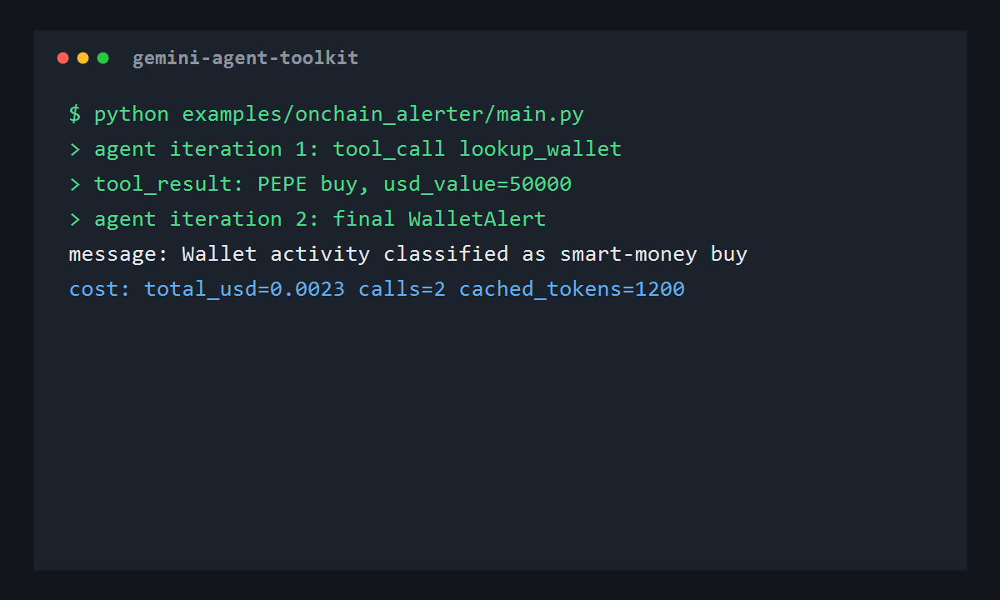

# gemini-agent-toolkit

**LangGraph for Gemini - production AI agents with streaming, cost tracking, prompt caching, and structured output in 30 lines.**

[](https://pypi.org/project/gemini-agent-toolkit/)
[](https://github.com/barobaonguyen/gemini-agent-toolkit/actions/workflows/ci.yml)
[](LICENSE)
[](pyproject.toml)

```bash
pip install gemini-agent-toolkit
```

[See examples](examples/) | [Quickstart](docs/quickstart.md)



## Why This Exists

LangChain is powerful, but it carries multi-provider abstractions you do not always need. The raw Gemini SDK is clean, but it leaves orchestration, tool schemas, retries, memory, structured output parsing, and cost accounting to every project. `gemini-agent-toolkit` is the middle ground: Gemini-only, Python-only, small enough to understand, and shaped around production chores that repeat in real client work.

## 30-Second Example

```python
from pydantic import BaseModel
from gat import Agent, GeminiClient, tool


class TokenInfo(BaseModel):
    symbol: str
    market_cap_usd: float
    risk_score: int  # 1-10


@tool
def fetch_token(symbol: str) -> dict:
    """Fetch token info from DexScreener.

    Args:
        symbol: Token symbol like PEPE.
    """
    return {"symbol": symbol, "market_cap_usd": 50_000_000, "liquidity_usd": 2_000_000}


client = GeminiClient(model="gemini-2.5-flash")
agent = Agent(client=client, tools=[fetch_token])

result = agent.run(
    task="Get info for PEPE token and assess risk 1-10",
    output_schema=TokenInfo,
)

print(result)
print(client.cost_tracker.summary())
```

Output:

```python
TokenInfo(symbol='PEPE', market_cap_usd=50000000.0, risk_score=6)
{'total_usd': 0.0023, 'calls': 3, 'cached_tokens': 1200, ...}
```

## Streaming

Stream direct model output while keeping token usage in `CostTracker`:

```python
from gat import GeminiClient

client = GeminiClient(model="gemini-2.5-flash")

for chunk in client.stream("Explain Gemini prompt caching in 5 bullets."):
    print(chunk, end="", flush=True)

print(client.cost_tracker.summary())
```

Tool-using agents can stream event objects:

```python
from gat import Agent, GeminiClient

agent = Agent(client=GeminiClient(), tools=[...])

for event in agent.stream("Research Gemini search grounding and cite sources."):
    if event.type == "chunk":
        print(event.payload["text"], end="", flush=True)
    elif event.type == "tool_call":
        print("\ncalling", event.payload["name"])
```

## Parallel Tools (async loop)

`Agent.arun()` is an `asyncio` agent loop. When the model requests several tool
calls in one turn, they are dispatched **concurrently** with `asyncio.gather`
instead of one after another — three 200ms lookups finish in ~200ms, not 600ms.
Cost accounting and per-tool retry stay intact: each call still flows through the
same client and registry. Sync tools run in worker threads; `async def` tools are
awaited directly.

```python
import asyncio
from gat import Agent, GeminiClient, tool


@tool
def price(symbol: str) -> dict:
    """Fetch a token price."""
    return {"symbol": symbol, "usd": 1.23}


agent = Agent(client=GeminiClient(), tools=[price])

# The model can answer with {"tool_calls": [{...}, {...}, {...}]} and all three
# run together. Single-call {"tool_call": {...}} turns still work.
result = asyncio.run(agent.arun("Price BTC, ETH, and SOL, then summarize."))
```

## Eval Harness

`gat.eval` runs a golden-set suite (JSON or YAML: `prompt` + `expected`) through
an agent and scores each case with one of four matchers — `exact`, `contains`,
`regex`, or an optional Gemini `llm_judge` — then reports a pass-rate and the
total USD cost the run accumulated.

```python
from gat import Agent, GeminiClient, evaluate, load_cases

agent = Agent(client=GeminiClient(model="gemini-2.5-flash"))
report = evaluate(agent, load_cases("examples/eval_suite/cases.yaml"))

print(report.pass_rate)   # 0.0 - 1.0
print(report.total_usd)   # cost of the eval run
```

A ready-to-run fixture suite lives in [`examples/eval_suite/`](examples/eval_suite/).

## `gat` CLI

Installing the package exposes a `gat` console command with three subcommands.
Keys are read from `GEMINI_API_KEY` (never from arguments).

```bash
gat run "Summarize the latest Gemini pricing changes."   # one-shot agent
gat eval examples/eval_suite/cases.yaml                   # run an eval suite
gat cost gemini-2.5-flash 100000 10000                    # price a token count -> $0.05500000
```

`gat run` accepts `--memory {memory,jsonl,sqlite}` (with `--memory-path`) — the
agent's memory backend is now selectable. The SQLite backend (`gat.SqliteStore` /
`gat.build_memory("sqlite", path=...)`) is a durable drop-in for `JsonlStore`,
with the same `add` / `replay` / `clear` contract.

## What's In The Box

- **Agent loop**: a compact orchestration loop with max-iteration enforcement, tool execution, and memory writes.
- **Parallel tools**: `Agent.arun()` runs multiple tool calls from one turn concurrently via `asyncio.gather`, keeping cost tracking and retry intact.
- **Eval harness**: `gat.eval` scores a golden-set suite with exact / contains / regex / LLM-judge matchers and reports pass-rate plus total cost.
- **CLI**: a `gat` console command with `run`, `eval`, and `cost` subcommands, plus a selectable JSONL or SQLite memory backend.
- **Streaming**: `GeminiClient.stream()` yields text chunks and `Agent.stream()` emits chunk/tool/final events.
- **Tool decorator**: `@tool` extracts Python signatures, type hints, docstring descriptions, and OpenAPI-style parameter schemas.
- **Google Search grounding helper**: `google_search_grounding_tool(client)` returns an agent-callable search tool backed by Gemini grounding metadata.
- **Structured output**: `generate_structured()` returns a validated Pydantic model, not a loose dict.
- **Cost tracking**: per-call token accounting with frozen Gemini 2.5 Pro, Flash, and Flash-Lite pricing.
- **Prompt caching helpers**: cache-key utilities plus a thin explicit-cache wrapper for the Google GenAI SDK.
- **Retry primitives**: exponential backoff and a circuit breaker that distinguishes transient 429/503 errors from hard quota/auth failures.

## Reference Examples

| Example | What it does | Demonstrates |
|---|---|---|
| [X Scout](examples/x_scout/) | Pull candidate posts, rank them with Gemini structured output, emit ranked JSON. | Structured output, batch API, cost tracking |
| [On-chain Alerter](examples/onchain_alerter/) | Receive wallet activity, enrich it, classify with Gemini, and optionally send Telegram alerts. | Tool use, memory, retry |
| [News Digest](examples/news_digest/) | Read RSS feeds, dedupe through JSONL memory, summarize into Markdown. | Prompt caching, JSONL replay, structured summaries |
| [Research Agent](examples/research_agent/) | Decompose a research question, call Gemini Google Search grounding, stream the answer with citations. | Streaming, tools, memory, grounded sources |
| [Eval Suite](examples/eval_suite/) | A golden-set fixture suite for `gat eval` covering exact, contains, regex, and LLM-judge matchers. | Eval harness, matchers, pass-rate + cost report |

## Cost Optimization

The pricing table in `gat.pricing` is frozen on 2026-06-10 from the Gemini Developer API pricing page. It intentionally tracks a small set of commonly used text models so local estimates are deterministic. Price a token count from the table directly with `gat cost <model> <input> <output>`.

| Model | Input / 1M | Cached input / 1M | Output / 1M | Same 100k in + 10k out |
|---|---:|---:|---:|---:|
| Gemini 2.5 Pro | $1.25 | $0.125 | $10.00 | $0.2250 |
| Gemini 2.5 Flash | $0.30 | $0.03 | $2.50 | $0.0550 |
| Gemini 2.5 Flash-Lite | $0.10 | $0.01 | $0.40 | $0.0140 |

For high-volume classification and ranking, the cheap path is usually Flash-Lite or Flash with `thinking_budget=0`, plus cached system prompts for repeated jobs. A naive Pro pipeline that repeatedly sends the same long context can cost an order of magnitude more than a cached Flash pipeline.

More detail: [Cost Optimization](docs/cost_optimization.md).

## When To Use This

Use this when you are building Gemini-first Python agents and want the repeated production pieces solved without adopting a broad framework — now including parallel tool execution, a golden-set eval harness, and a `gat` CLI. Use raw `google-genai` when you only need one or two calls. Use LangChain or LangGraph when you need a large ecosystem of integrations, graph orchestration, or multi-provider portability. Need crawler-scale collection before synthesis? → Trawlkit.

See [Comparison](docs/comparison.md).

## Install And Quickstart

```bash
pip install gemini-agent-toolkit
export GEMINI_API_KEY="..."
```

Windows PowerShell:

```powershell
$env:GEMINI_API_KEY="..."
```

Then follow [docs/quickstart.md](docs/quickstart.md).

## Contributing

Issues and small PRs are welcome. Keep the project Gemini-native, Python-only, and focused on orchestration, streaming, structured output, caching, retries, memory, evaluation, and cost visibility. RAG integrations, browser automation, and multi-provider abstractions are intentionally outside v0.3.

## License

MIT
